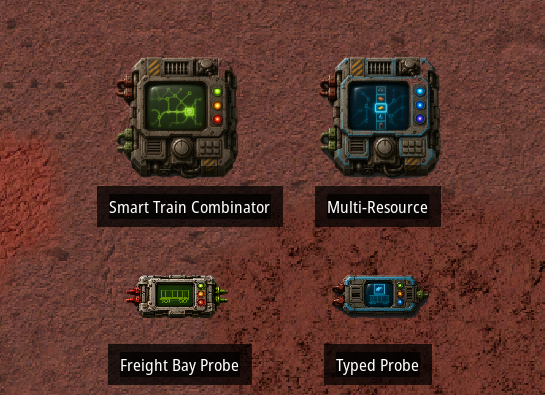
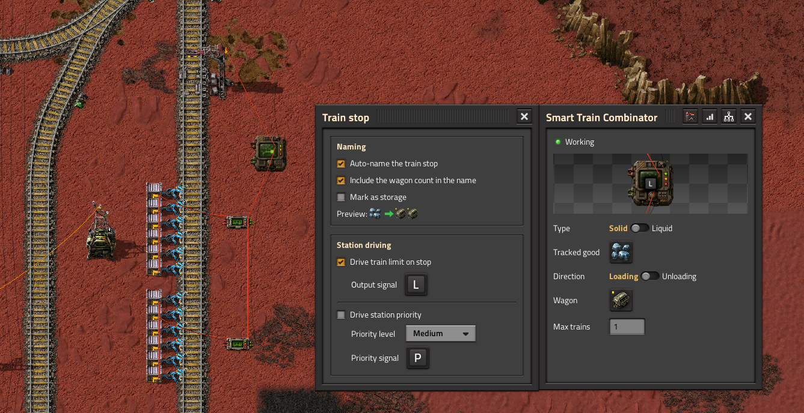
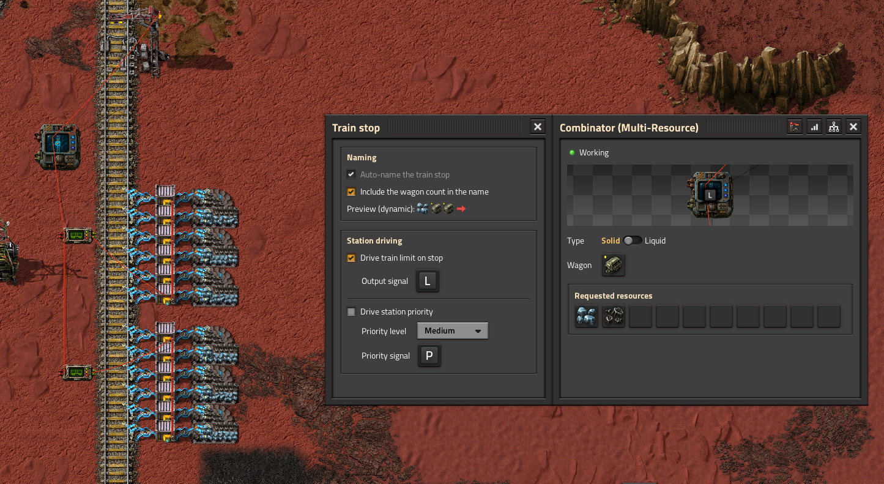
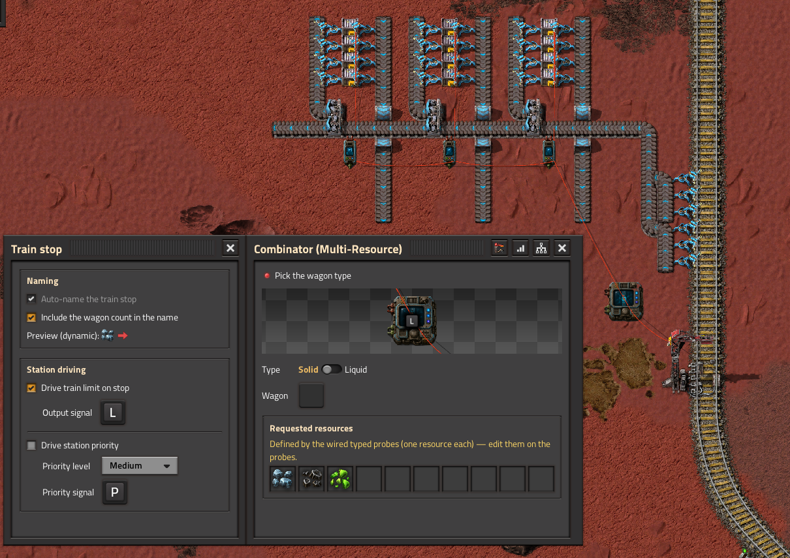
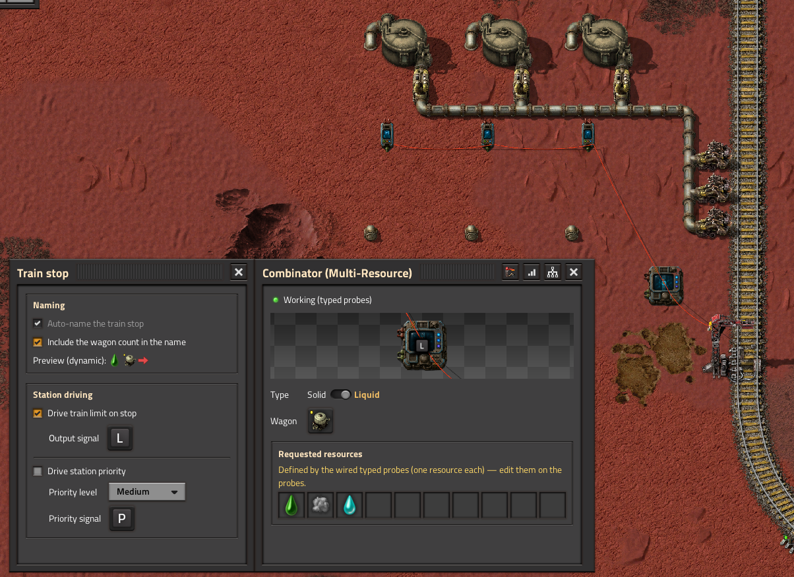

# Smart Train Combinator

A Factorio 2.1 mod (also available for 2.0). Train-stop combinators that call a train only when the
buffers are **genuinely ready** — validating **each wagon's dedicated buffer individually** instead
of pooling all of a station's storage together.

Two combinators are provided:

- **Smart Train Combinator** — a single tracked resource, per-wagon validation (the original).
- **Smart Train Combinator (Multi-Resource)** — a FIFO dispatcher: tracks up to 10 resources and
  calls one mono-resource train at a time by renaming the stop (with your train interrupts).



Wiring is entirely by cable (no proximity magic). One **Freight Bay Probe** per wagon reads that
wagon's buffer in isolation; the main combinator reads every probe and drives the stop.

## Why

The usual approach (e.g. the original [Simple Train Combinator](https://mods.factorio.com/mod/simple-train-combinator))
sums all of a station's storage and does `floor(total / train_capacity)`. Nothing guarantees that
*each* wagon's buffer actually holds its share, so a train can be called while one bay is still
empty. Smart Train Combinator checks every wagon's own buffer and only calls a train when each one
is genuinely ready — and a train is only ever called when a **full wagon** of the resource (or a
full wagon of free room, when unloading) is available.

## The three modes

### Mode 1 — Single resource (the original)

The **Smart Train Combinator** tracks one item/fluid. Place one **Freight Bay Probe** per wagon,
wire each probe's input to that wagon's buffer chests/tanks and its output to the main. Loading or
unloading, with a configurable max-trains. Each tick:

```
trains = MIN over wagons of floor(buffer / per-wagon capacity)   (loading)
         MIN over wagons of floor(free   / per-wagon capacity)   (unloading)
```

so the bottleneck wagon decides, and a train is called only when every bay is ready.



### Mode 2 — Multi-resource, shared buffer

The **Multi-Resource** combinator with the generic **Freight Bay Probes**: several resources share
the same buffer bays. Pick up to 10 resources; the module renames the stop to request **one at a
time** (FIFO) and commits to it until a train arrives, then moves to the next. Each train is
mono-resource, so a train is only called when a **full wagon** of that resource is available (and,
when unloading, only when the shared bay has room for a full wagon — all resources counted).

Best for **2–3 resources** with generously-sized chests. Auto-naming is mandatory (it's what routes
the trains); the train limit is 0 or 1.



### Mode 3 — Multi-resource, one buffer per resource (typed probes)

The **Multi-Resource** combinator with **Typed Freight Bay Probes**: each probe is pinned to one
resource (its picker follows the main's Type — item or fluid). A resource's wagons are its own typed
probes, so **train length can vary per resource** (e.g. 1 iron probe + 2 coal probes ⇒ a 1-wagon
iron train and a 2-wagon coal train), each with its **own independent buffer**. The resource list is
derived from the wired probes (the main's grid is greyed and shows them).

Best for **many resources**, and the way to do **multiple fluids** (each fluid gets its own tank —
tanks can't be mixed). Pair it with the **enable gate** (below) to drain a shared pipe section
before the next fluid train.





## Shared features

- **Enable gate** ("enable when") on both combinators: pick a signal + comparator + value; while the
  condition is false the module requests **0 trains** (the stop stays active). Its own *Circuit
  condition* panel. Ideal for fluids: request the next train only once the common pipe is empty
  (`[pipe fluid] = 0` — in 2.1 you can wire a pipe directly).
- **Auto-naming**: builds the stop name from the tracked good, a load/unload arrow and one wagon
  icon per wagon, with a live preview. An optional **storage marker** adds a warehouse icon to the
  name (to tell an evacuation/storage stop apart).
- **Priority**: optional priority signal on a High / Important / Medium / Low level scaled by fill.
- Cargo (items, any quality) **and** fluids; per-wagon capacity read from the chosen rolling-stock
  prototype, so modded wagons work.
- **Buffer monitor** window (per-resource / per-wagon readout) and a **train-stop config** window,
  glued to the main window.
- Blueprint, copy/paste and parametrization support.
- English and French locale. **Nullius** and **Ultracube** compatible.

## Entities

| Entity | Footprint | Role |
|---|---|---|
| Smart Train Combinator | 2×2 | Single-resource brain (Mode 1) |
| Smart Train Combinator (Multi-Resource) | 2×2 | FIFO dispatcher (Modes 2 & 3) |
| Freight Bay Probe | 1×2 | Passive, one per wagon (shared buffer) |
| Typed Freight Bay Probe | 1×2 | Passive, one per wagon, pinned to a resource (independent buffer) |

## Usage

1. Research **Smart Train Combinator** (unlocks all four entities).
2. Build a main combinator + one probe per wagon; wire each probe's **input** to that wagon's buffer
   chests/tanks, its **output** to the main, and the main to the train stop.
3. Open the main and configure: tracked resource(s), wagon type, direction (single module), and the
   options you want (train limit, auto-naming, priority, enable gate).
4. For Mode 3, open each **Typed** probe and pin its resource.

The mod ships for both Factorio 2.0 and 2.1 as separate releases (same code, `info.json` only
differs) — the mod portal serves the right one for your game.

## Credits

Inspired by **Simple Train Combinator** by *Odja_Anarchist* (GPLv3). This is an independent
implementation (no code reused), not a fork.

## License

[MIT](LICENSE) © 2026 kardagan
