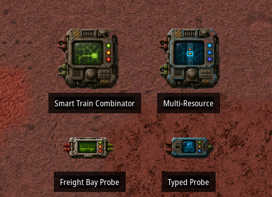
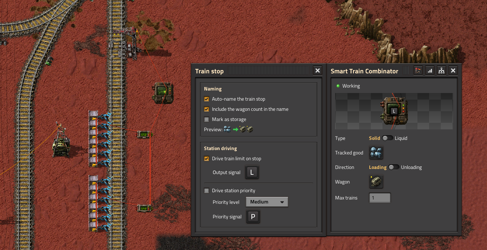
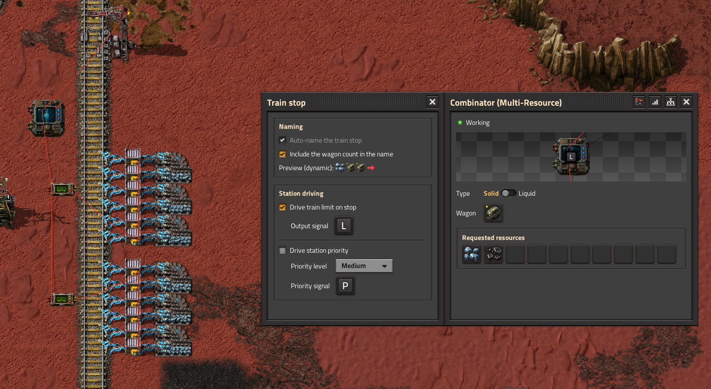
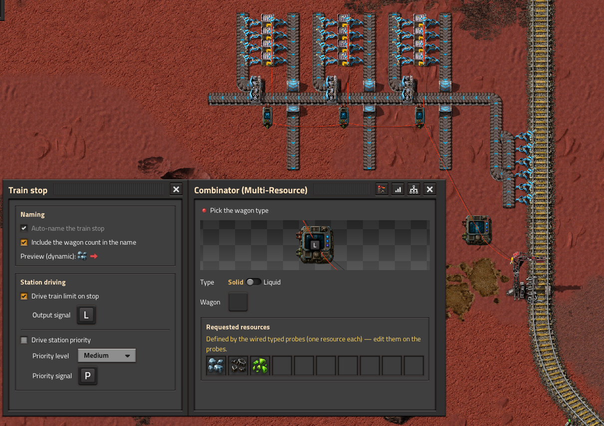
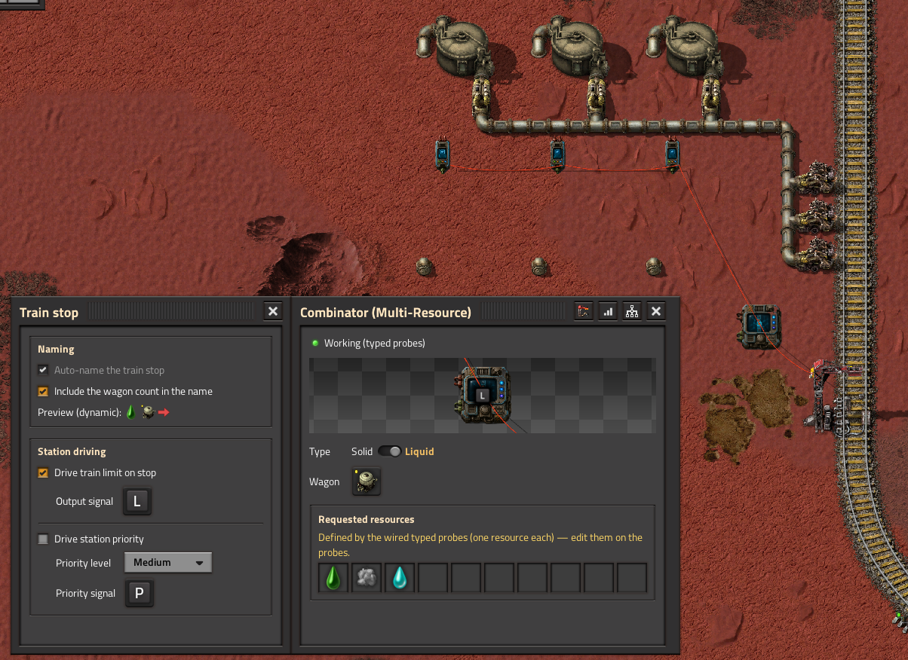
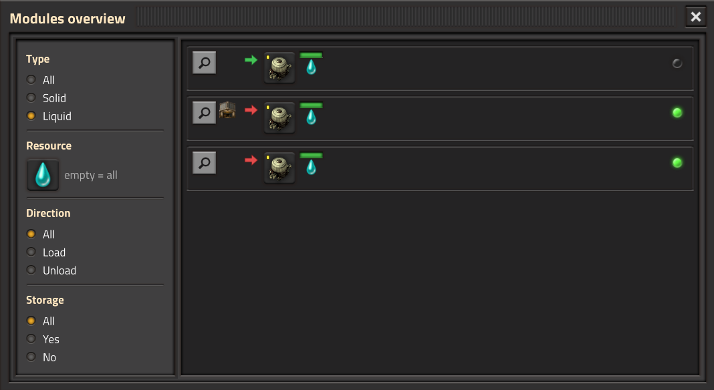

# Smart Train Combinator

A Factorio 2.1 mod. Train-stop combinators that call a train only when the
buffers are **genuinely ready** — validating **each wagon's dedicated buffer individually** instead
of pooling all of a station's storage together.

Two combinators are provided:

- **Smart Train Combinator** — a single tracked resource, per-wagon validation (the original).
- **Smart Train Combinator (Multi-Resource)** — a demand-driven dispatcher: tracks up to 10
  resources and calls one mono-resource train at a time by renaming the stop (with your train
  interrupts), always asking for the emptiest buffer first.



Wiring is entirely by cable (no proximity magic). One **Freight Bay Probe** per wagon reads that
wagon's buffer in isolation; the main combinator reads every probe and drives the stop.

## Why

The usual approach (e.g. the original [Simple Train Combinator](https://mods.factorio.com/mod/simple-train-combinator))
sums all of a station's storage and does `floor(total / train_capacity)`. Nothing guarantees that
*each* wagon's buffer actually holds its share, so a train can be called while one bay is still
empty. Smart Train Combinator checks every wagon's own buffer and only calls a train when each one
is genuinely ready — and a train is only ever called when a **full wagon** of the resource (or a
full wagon of free room, when unloading) is available.

## The three modes

### Mode 1 — Single resource (the original)

The **Smart Train Combinator** tracks one item/fluid. Place one **Freight Bay Probe** per wagon,
wire each probe's input to that wagon's buffer chests/tanks and its output to the main. Loading or
unloading, with a configurable max-trains. Each tick:

```
trains = MIN over wagons of floor(buffer / per-wagon capacity)   (loading)
         MIN over wagons of floor(free   / per-wagon capacity)   (unloading)
```

so the bottleneck wagon decides, and a train is called only when every bay is ready.



**Example blueprint** — One main combinator, two generic probes — one per wagon. Each probe is wired to its own six chests, and only to those: that isolation is the whole point. The main calls a train only once *both* probes report a full wagon's worth.
([raw string](https://raw.githubusercontent.com/kardagan/factorio-smart-train-combinator/main/docs/blueprints/mode1.txt) if the block below is awkward to select)

```
0eNq9WE1v4zYQ/S88FtTCEilbMpp/0MMeejMMgbYZh4gkuhSV3SDwf+8MZTn2rlINfSgCRNSIfHzzZoYf/mC7utcnZ1rP1h/M7G3bsfXmg3Xm2Koaba1qNFszp0zNzpyZ9qB/snV63nKmW2+80cOI8PJetX2z0w468HFk52Hs8cUnAYKzk+1glG0RHJCKFWfvbJ2kCwHwB+P0fvgqz/w31OyKiqBt0nl7moAsR8j8HjKF8eCid7audvpFvRnrcEwAqxDspA/Vp+/+/YRzvRnne4XcR5dCj+RvFKTTvgrju6o2jQEdves1Z7c2OuRfIyTExDpwfYQb3+lQ39kZsbwafGcb43XzZJxtE+v0dnMZlwzdnzq/z5LaqsN26LhX7miTH+po2wkLmwiOIIe8jAi5pKKWaQRq/onaKOeTIZ32ttmZVnnIit/hxQi/vIcvpnOqG753920olLGCOHs2tdfuV+tshnD2D3wIucFa65rQCaiflAvU1+wpGHos6sV5C3/A2KvjwAXijM9XmBG6YmTZnT8Mk4Bh5linjjDzs6o7yEBcHHDAJYHYYKkmuIQUqS5+3GTN9dPEmEb9vJRREMH2/tRH1c2EKuB1bdrXAbe6CHJTnaHiqwFoMGO7Gjjedb9WX63fNPBhjT6YHoULE3xZrLFufP/CjaO1B4weNpXXlW7VrtaHa2yCEZbCNfuTXd76Tle4nF99CNZgUUNinCfqYkmuNhFRbSsyah6BWlxRd339mkDqaAf1NIG6/HbFTb/9sicUE8jlDV+t62T/okHH/8RdAO4EUrqIJ1mWFI4peYctY3bYNCMTXkWqmgqirKt5WWU8S6KsNzsD7oi7/vlZu+Tk7E5PoBefVHFbmNoIFKwEL432Zo/VdzC3uwK835YkrHsn7cYN+w82WaLpkux7ERuhFTFCxXyEiniWxAiV5MSPOWdk9EotI2XNUqKs5aysWRbPkiZrJqjIgVycAJImwB3yVwrkD/AkSkDe/cDvmNRa0SmnsdIWVGnTeWnLB3jSpBULurQxJwuR0imLSGlFRpVWzEorxAM8idJKOrSMlSCnSiDnJVg+wJMowYqeXTEnTFHEHAYA+/8/DYiIms0joy8X1Ojns9GX6QM8adGXGR069iYgBVWC+buAlA/wJEqQ0wsg5jYgI2o29jogV1Rp5+8DsniAJ1HaiAKLPW/n5AKbP3Dn6QM8aRLkGT27vj5ybzn7Ae/4c9cm4ynPebrlG/jP4c4loFliUwQrPjjcRkI7v2sLDqsydkcTh6M12vHB4ZQZ2hLbRWgLnEgMM+GDw5IW2sVnGx9cDvPig8thLnzwHPsA8/Az2frm13LO3rTrgmv5MitzmckyX2SrbHE+/wstj5N+
```

### Mode 2 — Multi-resource, shared buffer

The **Multi-Resource** combinator with the generic **Freight Bay Probes**: several resources share
the same buffer bays. Pick up to 10 resources; the module renames the stop to request **one at a
time**, always the **emptiest buffer** first, and holds that choice while a train is on its way.
Each train is mono-resource, so a train is only called when a **full wagon** of that resource is
available (and, when unloading, only when the shared bay has room for a full wagon — all resources
counted). Because generic probes can't be pinned to a resource, each resource is credited with its
**share** of the shared bay (slots ÷ number of tracked resources).

Best for **2–3 resources** with generously-sized chests. Auto-naming is mandatory (it's what routes
the trains); the train limit is 0 or 1.



**Example blueprint** — Same two generic probes, but the brain is the **Multi-Resource** combinator. The probes still read the same shared chests; the module picks one resource at a time and renames the stop accordingly, so a single station serves several resources.
([raw string](https://raw.githubusercontent.com/kardagan/factorio-smart-train-combinator/main/docs/blueprints/mode2.txt) if the block below is awkward to select)

```
0eNrNWdFuozgU/Rc/rswI2zhAtP2DfZiHfasq5CRuahVwFkxnqop/32uTpGRLBsPDeFWpGGMf33PPvRebfKBd2clTo2qDth9I7XXdou3jB2rVsRal7atFJdEWNUKVqMdI1Qf5E21J/4SRrI0ySg4z3M17UXfVTjYwAF9mtgbmHl9M5CAwOukWZunaggNSmmP0jrYRIRzgD6qR++Fp0uMvqPSKakHrqDX69BUyIxfI9BaSwHygaBpdFjv5It6UbuwcB1ZYsJM8FJ/czfvJrvWmGtMJa/uFkhsR/W0d0kpTuPltUapKgR9N00mMxn3+kH9dIEET3QD1C9zl3h/qO+otlhEDd/SojKwe9lqUT+emaI46+iGOup7qOeNGA9xDa/Y06upSi8MTmpCG+Qr+qY6H4Ik3KluAykeo+6jqSqMmEPkFMe+nw6Yd1mhv25ALlyTB6FmVRjb/7Z0NAoz+gQdOflTrpnKD9ro6iUYYuzh6cB2dzVtiGZ7BKZ4Pi2XgSd4/wR+4wIjjQBUiwV5fYU0YbCMH3bgcDWGCbPTpRhxh9WdRthDFtsDAcxuEaLgrJmxxAViceYxi8vpoYk4lfp7T0HlYd+bULcq7Ca8A51LVrwNucXbIKLtdxSgGoKHbtovBxpvh1+wt5ZsEe1AlD6qzbnML3E32pTS+36Fx1PowBOF5/FmBibHXIarRdaQbOTkMqv9RGFnIWuxKebgK7DqhJm/Rn+h817WysO+VqzNcr+sR1kNx30+k6MY78fmCxE+9UdMFqNkVddeVrxHEoGwg6ydQs29Xa9k3izxdH2ZE+pKtVg7r5iuadfSEofmIvpRltH+RIMsvzaRg5gQSiddwJgE4E++dSLZkJ0KotwPyRaL/Ku3WO4F5Kp/PK5+sIU5CEb951dNo1z0/yyY6NXonv1qcx58WZ3de+gIK80sljdrbGnZQ4x0A3I8LG7yGTrK57L/+QJOFjmx8/Tm2LkT1IKlfEI3tvBdE2RrSQcpH7ls+8iX7WupdP3MSvnxQ4qk8mVWe0jXEQ5UPyrytpWGTkyaeEtF5ifga0iGSk3rvEvMlx0OaejuA/Q+SM/NUns0rn68hHio5Weyt/pIzAiPeTuBhc55RT+X5rPKMrSEdIueZ9/4z34RPTsY9JdrMS7RZQzxYcnoftfMlR22WLdrPp79/P8/8a2gatnwksWdsprOxmZA1pEOUj8R//5mFLx+J57k9n/9ikyRriIcqHwn3Lh9Lvtok/jU0D5ycvoft+S82SbaGdJDk9K6dJI7DZyf3LKA3xt4RiZNV1EPlJ6e++UniJd9FOPPHvX+kAxI/4N465JFigjkmT/gR/mPCMYNmbpvM9doLJunQ5jdthmG7YYfbLkyJ67cXDKdt105sO3NtZhdiw0r2guH16trZZ9tecDKsay84GdayF8ztGLDc/Z62Hf0wj9EbSOGo8Q3NeUKTnMc0pXHf/wsn32p2
```

### Mode 3 — Multi-resource, one buffer per resource (typed probes)

The **Multi-Resource** combinator with **Typed Freight Bay Probes**: each probe is pinned to one
resource (its picker follows the main's Type — item or fluid). A resource's wagons are its own typed
probes, so **train length can vary per resource** (e.g. 1 iron probe + 2 coal probes ⇒ a 1-wagon
iron train and a 2-wagon coal train), each with its **own independent buffer**. The resource list is
derived from the wired probes (the main's grid is greyed and shows them).

Best for **many resources**, and the way to do **multiple fluids** (each fluid gets its own tank —
tanks can't be mixed). Pair it with the **enable gate** (below) to drain a shared pipe section
before the next fluid train.





**Example blueprint** — Three **typed** probes, each pinned to its own resource and its own chests — so each resource has an independent buffer and its own train length. This one is lifted from a working base, so it comes with the surrounding belts and power; delete what you don't need, the wiring is what matters.
([raw string](https://raw.githubusercontent.com/kardagan/factorio-smart-train-combinator/main/docs/blueprints/mode3.txt) if the block below is awkward to select)

```
0eNrNXE1v47wR/i86FvJC/CaD9tpTDy/a3hYLQ7a5ibCy5Epy3g0W+e8lKTuRE3E95Bxa5BBRkp9nOJzhjKihfhW79mxPQ9NNxcOvotn33Vg8fP1VjM1jV7f+XFcfbfFQ2J+nwY7jZhrqbjz1w7TZ2XYqXsui6Q72Z/FAXsuVnw110y5uoq/fysJ2UzM1diYKjZdtdz7u7OBQyusvR8fUPD5NmwBRFqd+dL/qOw/ukLgpi5fiYUOkcfCHZrD7+Sr3cnxApVBUQRJQ2RtqPY72uGub7nFzrPdPTWc3dAWcfhEXeEO+CEfg4JtTADg8193eHjb7Ztifm6m4Xtv+51y3jtTd0/XDsfbK/CQIf+/eeTdOdeD8TM8u5Fo66nfc1j7a7lAPL2vQAqw5lqA5+Ya6O7c/Nk032mFyFz6j8neV0aCyO8gqB5lAkHUOcgVBNmAdiwQdk6q847sr+O+Sq4+S6zUOguKQIA6K4hAgDobi4CAOjuJgIA6B4vjkYYSukUgUCYGRKBRJBSPRGBJtHMkaqkGh6nVUinJnrSKoKAfWMoKKclktIqgZTip/M6GtmgTlKBKYcVOBIdECRiLBYUWlpFIZjqmSR0GjSICjYDAkwFFgGW6rU9XFCIpEQpIURsH5j06MvowtLNXadrN/suMdmfn6HMF4jpSg2MoESsmw2MokigRm+EyhSEA5LdMZAxEi6v2BMMnmEguqvMqREpQac5RPagkaSU5RJLApjDMUCYeYC8/xWw3yWy7SzYVGzEXmSElAUqJ8UsPyXa4Xqthvjud2alZwrysr6hNmWez7bhr6druzT/Vz0w/+N+N8w3h7/PXX28pQWXxvWqenj2enl7D48dwM07n2iclVuLCKtPlHsVymuCx/eBGOp3qoJ09e/C2cOPvlq8r3+LrOdBf8jzRwUlWv39yf08hUP85dnfbU///hON3NzWSPxY2+inPX9vXBnRwdXv3o2L/X7WjLsM62XWH/s35cv3Csf259EucV6xTXn6fTedq+r7blaNJ1pW26HzPu9tLPaTg7+eZTTurTdgaaT/vj7Szjze2nwVmCN7TWPlsnT3G0h+bstREIrpc/3Z7ajT8i3Xjs+4MfEn9YT3Zru3rX2sObusPJ/uR+89fi0jqPdusXO9/6EM6GM/VsTKsTwHvoCSraeBX9zoMIzIPe9X2yB7g+/u07P9rpYhrbtjk2t2N4OZdiKRfI6KAljJb3luty5EPxr5f+pf/7P1dXGSvws0rKsq/IiMEmNfkWFEUCSr4FAwcek5h8Cw4Mj+Zu8i1EjpSgIC4kSsmw5FsoFAks+RYaRQJKvoXJGAhY8i2rZHOJJd+S5EgJSr4lyieBybdkKBJY8i05igSUfMscv4Ul31Kmm0sk+ZYqR0pQ8i1RPglMvmX6cpOsUoORqlAkoGCkwH67hAYFI0Vh5rIEjgQjxXKkBBm14iglw4KREigSWDBSEkUCCkZKZQwELBgpnWwusWCkTI6UoGCkUT4JDEaaoEhgwUhTFAkoGOkcv4UFI83TzSUSjLTIkRIUjDTKJ4HBSCvoA5dMqYjR6YFUktQYpw2KJPLO0oCXgpdgoKhmCNDuyN2oZmiOlCDvMAylVlhUMxxFAotqRqBIqojqZYbqYXHMqGQDicUxo3OkBMUxg/I7YBwjVYViEUAWgmKJeCepctwTFrxIxdKNhMbk5DlyEpicKO8Dxi9SZURJ+psHnQgLPHelqSVnFTR5pXejAqlMjpwwu8uoI1ySAGvKMioJlyxAqyE0Q0+wOZwQljyesUmcEJ4jJ7BkU2A0DZ3GCco/Pz8qRFhy/BM435J0/4zOtyTHP4HzLUX5J3S+peDCfJlSCE4ySgUlS57HKfyhkqXO4xT6VMnuz+NU5MgJs2cqUZoGzuMZ5YFLFqg16gw9AedxapLHMzqPsypHTtg8nlH0tyQBeg5D+Sd0Hmc5/gmcx1m6f0bncZbjn8B5nKH8EzqPZ9T+SZ48CzCNYQHbpkGxADXGq5uiKV/0cNichn5nV+DjW0L4euVHPTTT09FOzd4XnxyaZSGVay8rUsqiP9nhWk3xl+JjLdI2iLbYe3dq69EBb3b1sF7s9L09N9cqmdV6F8JJRufDdPi/7rxtHfnQd67/73vq8nRAc3RA/w90sPf1RMNm76uhsnvPQJsL3zquOHxzIeEcnFUmbX3jGc846fuguMSwQGe5jMrQJQt0lsuYsWW6xgyGBaoxUaFYgBrLKC5bsCjQnlMi4AsWC+wKtlfw84L/eHJuuw6vlmvwq3A8By622YsIkQOnYnvyBHg3lEzZDUUyasakuvuugWRUiS1gozsThUHBxh5zZIWCVTFYgoKVMViKgo09u2eUgy1hWQyWo2BjTzJSoGBjk4CUKNiYO0iUl6mo3aK8TEXtFuVlKma3CuVlKjbRKpSXqZg7KJSXAcNjQpGXSg2PKime6S83CfCHmv95+8siMz/YkNcP53DTxj2pdZ0dQFtSXt+2f7yX6Ls0+/u0mmHnlJHp5GGAvxrXycMAr1RJ2RpAVIbvm1uzh3zFwKBYGPAzBhWKJRYjcmrKzK3trMLCc1qTai06PQirKnlUNUexAL+AAa8xW4ID9QROh1VK/RfR6YFakXT9axQLVP/gl3ZLcJj+TbrHKpqsJwN+aaeSXtqZ9NiuWLr0DMUCC10G/KZ9iQ0c5PTYq3i6miSKBagm8Iv2JTZQTRpspUmLgBn1akqkqp9m1KstWUDqpxV4y8USG6R+WmU4s0xXE0OxsNhHkTgKlsZgBQqWxGDBebKSycMIzpNV0ud+qoxYq1JjLYUXsKnUBzmaUcCmdHIPCNxFdXIPwN+vVElfxbwpWfstro5ngd/K4k/X9t92+MpLUfo3RuJb+ZWxkpSCl8QfG3csq3DMhT+W87F2x/4FG7s2uAkX/O9KRcOx/13pHtfCsftdqWdQf7l0KU449r91Qcof+8ulL5f1DX+99LWWoaF8g8xXwh2lL/OaW0EUOkOHe0pfCjK3wjV2uUYDPq8uLRNasxjhntCh0HL3sHCNhRYJLd9Zp7PwuYiHxedXy+LZDmNQqpDUCE65ERVVtHp9/S8OY9jq
```

## Shared features

- **Enable gate** ("enable when") on both combinators: pick a signal + comparator + value; while the
  condition is false the module requests **0 trains** (the stop stays active). Its own *Circuit
  condition* panel. Ideal for fluids: request the next train only once the common pipe is empty
  (`[pipe fluid] = 0` — in 2.1 you can wire a pipe directly).
- **Auto-naming**: builds the stop name from the tracked good, a load/unload arrow and one wagon
  icon per wagon, with a live preview. An optional **storage marker** adds a warehouse icon to the
  name (to tell an evacuation/storage stop apart).
- **Priority**: optional priority signal on a High / Important / Medium / Low level scaled by fill.
- Cargo (items, any quality) **and** fluids; per-wagon capacity read from the chosen rolling-stock
  prototype, so modded wagons work.
- **Buffer monitor** window (per-resource / per-wagon readout) and a **train-stop config** window,
  glued to the main window.
- Blueprint, copy/paste and parametrization support.
- English and French locale. **Nullius** and **Ultracube** compatible.

## Overview screen

A game-wide screen listing **every** Smart Train Combinator module in your save, so you can review and
tune them all from one place. Open it with the shortcut-bar button or the customizable key
(**Ctrl + Alt + T** by default).



Each row shows, from left to right:

- an **eye** button — closes the overview, jumps the view to that module and opens its window;
- the **direction** arrow (load / unload) and, for storage-flagged modules, the **warehouse** icon;
- the **wagon type**, editable inline (the only thing you can change from this screen);
- the **fill bars** — one bar over its resource icon. A single module shows one bar per wagon; a
  multi-resource module shows one bar per requested resource (its aggregate fill), so all tracked
  goods are visible at once;
- the resource whose **train is being called** right now (multi module), next to
- the **station-call indicator**: green = calling a train, red = misconfigured, grey = idle.

The left column filters the list by **type** (item / fluid), **resource** (a picker that appears
once a type is chosen), **direction** and the **storage** flag.

## Entities

| Entity | Footprint | Role |
|---|---|---|
| Smart Train Combinator | 2×2 | Single-resource brain (Mode 1) |
| Smart Train Combinator (Multi-Resource) | 2×2 | Demand-driven dispatcher (Modes 2 & 3) |
| Freight Bay Probe | 1×2 | Passive, one per wagon (shared buffer) |
| Typed Freight Bay Probe | 1×2 | Passive, one per wagon, pinned to a resource (independent buffer) |

## Usage

1. Research **Smart Train Combinator** (unlocks all four entities).
2. Build a main combinator + one probe per wagon; wire each probe's **input** to that wagon's buffer
   chests/tanks, its **output** to the main, and the main to the train stop.
3. Open the main and configure: tracked resource(s), wagon type, direction (single module), and the
   options you want (train limit, auto-naming, priority, enable gate).
4. For Mode 3, open each **Typed** probe and pin its resource.

The mod targets Factorio 2.1. Support for 2.0 was dropped in 1.8.0; the last 2.0-compatible
release is 1.6.1.

## Credits

Inspired by **Simple Train Combinator** by *Odja_Anarchist* (GPLv3). This is an independent
implementation (no code reused), not a fork.

## License

[MIT](LICENSE) © 2026 kardagan
